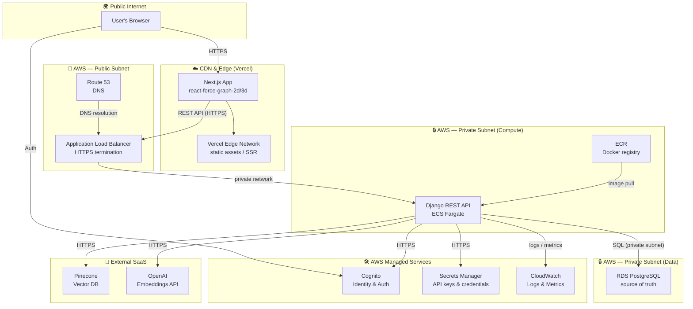

## System Architecture

```mermaid
graph TB
    subgraph INTERNET["🌍 Public Internet"]
        Browser["User's Browser"]
    end

    subgraph CDN["☁️ CDN & Edge (Vercel)"]
        NextJS["Next.js App<br/>react-force-graph-2d/3d"]
        VercelCDN["Vercel Edge Network<br/>static assets / SSR"]
    end

    subgraph AWS_PUBLIC["🔶 AWS — Public Subnet"]
        Route53["Route 53<br/>DNS"]
        ALB["Application Load Balancer<br/>HTTPS termination"]
    end

    subgraph AWS_COMPUTE["🔒 AWS — Private Subnet (Compute)"]
        Django["Django REST API<br/>ECS Fargate"]
        ECR["ECR<br/>Docker registry"]
    end

    subgraph AWS_DATA["🔒 AWS — Private Subnet (Data)"]
        RDS["RDS PostgreSQL<br/>source of truth"]
    end

    subgraph AWS_MANAGED["🛠️ AWS Managed Services"]
        Cognito["Cognito<br/>Identity & Auth"]
        Secrets["Secrets Manager<br/>API keys & credentials"]
        CloudWatch["CloudWatch<br/>Logs & Metrics"]
    end

    subgraph SAAS["🔌 External SaaS"]
        Pinecone["Pinecone<br/>Vector DB"]
        OpenAI["OpenAI<br/>Embeddings API"]
    end

    Browser -->|"HTTPS"| NextJS
    Browser -->|"Auth"| Cognito
    NextJS --> VercelCDN
    NextJS -->|"REST API (HTTPS)"| ALB

    Route53 -->|"DNS resolution"| ALB
    ALB -->|"private network"| Django
    ECR -->|"image pull"| Django

    Django -->|"SQL (private subnet)"| RDS
    Django -->|"HTTPS"| Pinecone
    Django -->|"HTTPS"| OpenAI
    Django -->|"HTTPS"| Cognito
    Django -->|"HTTPS"| Secrets
    Django -->|"logs / metrics"| CloudWatch
```
