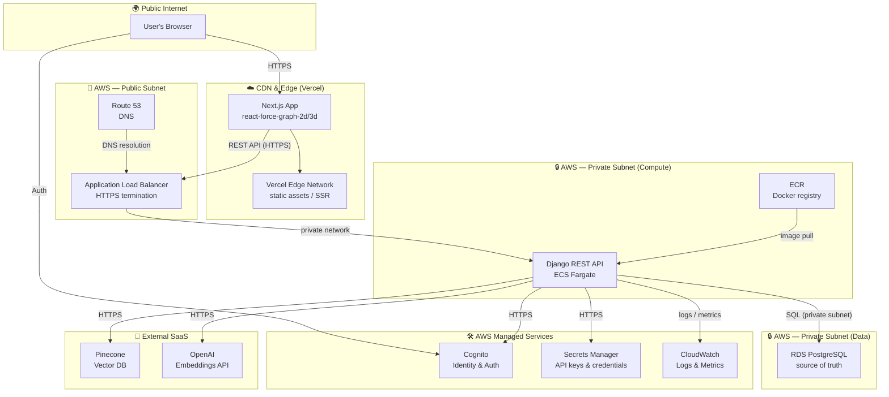
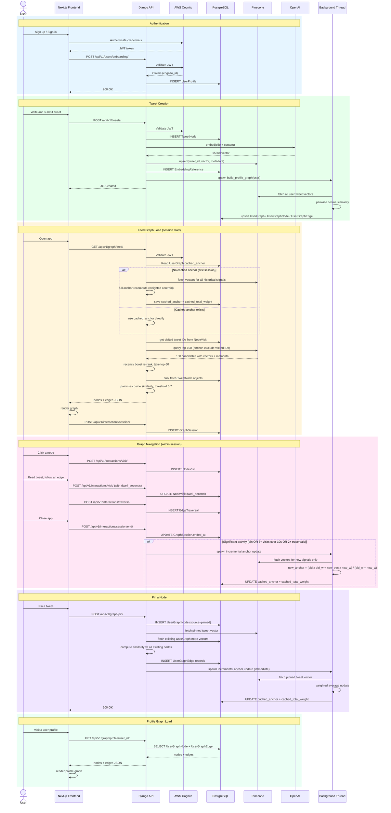
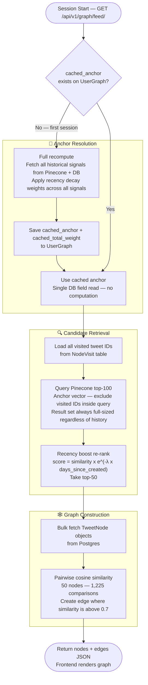
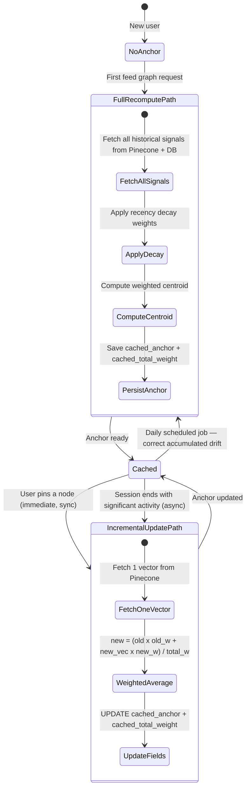
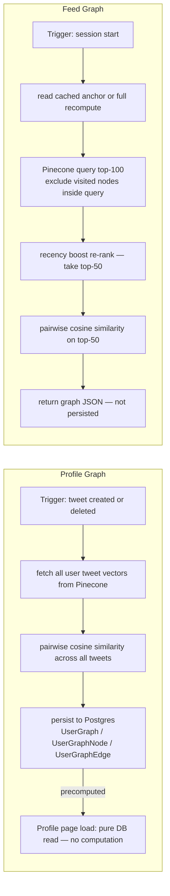
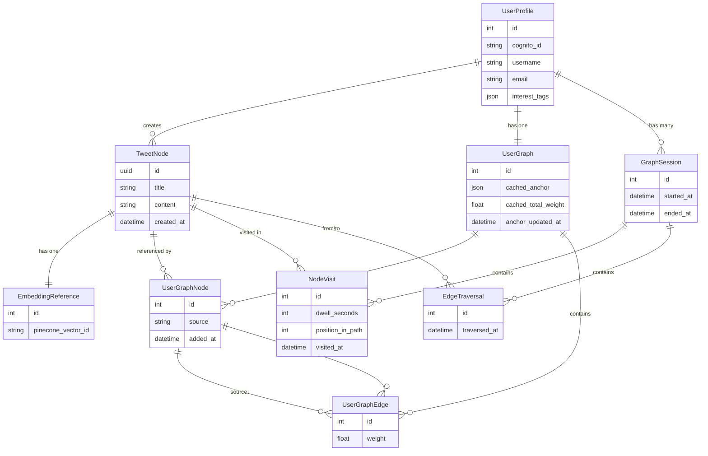

# SonderAI — Architecture Diagrams

---

## 1. System Architecture

Infrastructure grouped by security zone and network boundary.

---

## 2. System Workflow

End-to-end behavior across all major user journeys.

---

## 3. Feed Graph Construction Flow

Detailed flowchart of the feed graph algorithm.

---

## 4. Anchor Lifecycle

How the anchor embedding is created, cached, and kept fresh.

---

## 5. Profile Graph vs Feed Graph

How the two graph types differ in construction, storage, and serving.

---

## 6. Data Model

Core models and their relationships.

