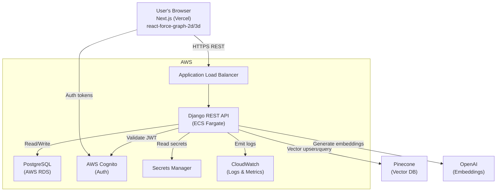
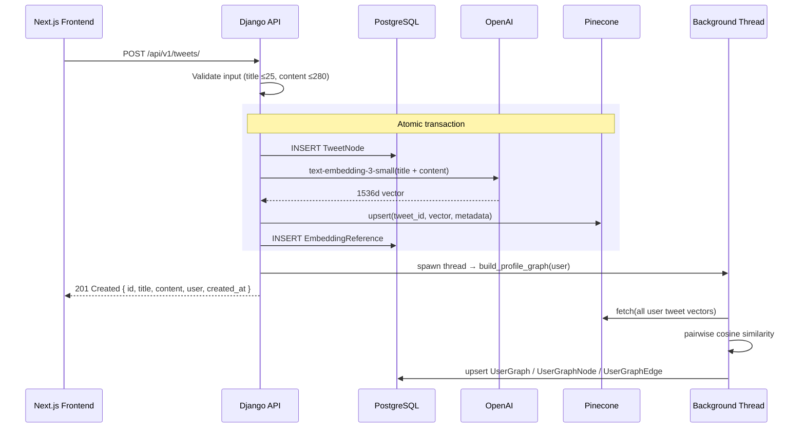
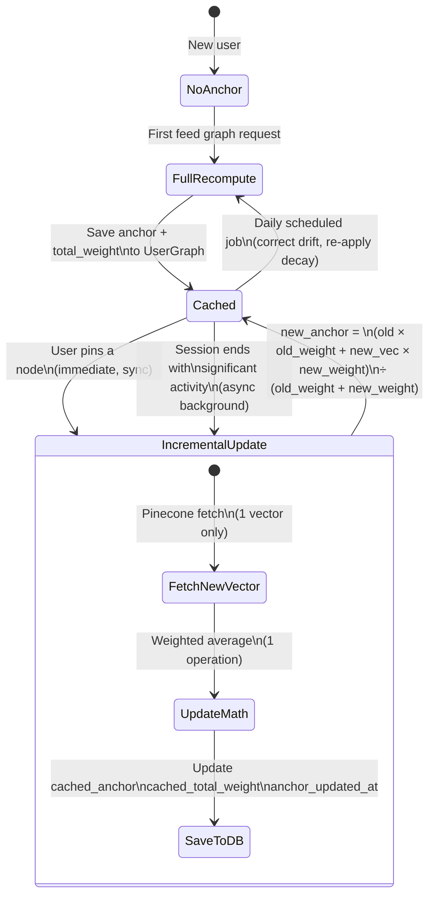
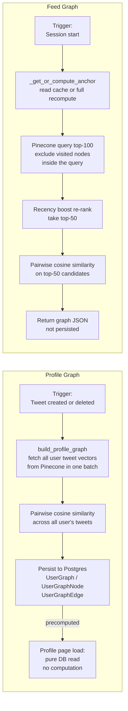
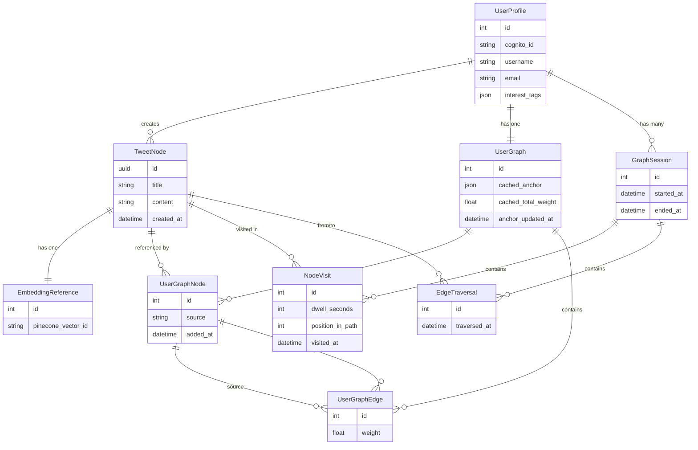

# SonderAI — Architecture Diagrams

---

## 1. System Architecture

High-level infrastructure. Shows how the major components connect.



---

## 2. Tweet Creation Flow

What happens end-to-end when a user creates a tweet.



---

## 3. Feed Graph Construction Flow

What happens when a user opens the app and their feed graph is built.

```mermaid
flowchart TD
    A([Session Start\nGET /api/v1/graph/feed/]) --> B{UserGraph.cached_anchor\nexists?}

    B -->|Yes| D[Use cached anchor]
    B -->|No| C[_full_anchor_recompute\nfetch all historical signals\nfrom Pinecone + DB]
    C --> C2[Save anchor + total_weight\nto UserGraph]
    C2 --> D

    D --> E[Get all visited tweet IDs\nfrom NodeVisit table]
    E --> F[Query Pinecone top-100\nwith visited IDs excluded\ninside the query]
    F --> G[_recency_boost\nre-rank by similarity × e^\(-λ × days\)\ntake top-50]
    G --> H[Bulk fetch TweetNode\nobjects from Postgres]
    H --> I[_compute_edges\npairwise cosine similarity\nO n² at n=50 = 1225 comparisons\nthreshold = 0.7]
    I --> J[Return graph JSON\n{ nodes, edges }]
    J --> K([Frontend renders graph\nreact-force-graph-2d/3d])
```

---

## 4. Anchor Lifecycle

How the anchor embedding is created, cached, and kept fresh over time.



---

## 5. Profile Graph vs Feed Graph

How the two graph types differ in construction, storage, and serving.



---

## 6. Data Model

How the core models relate to each other.


