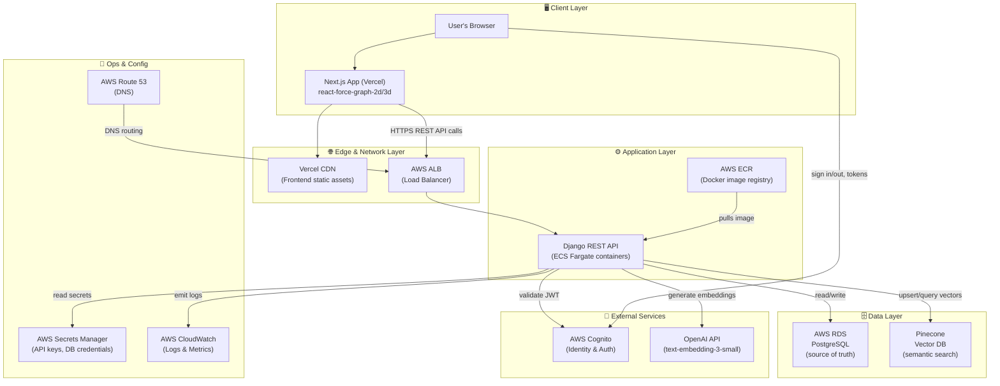
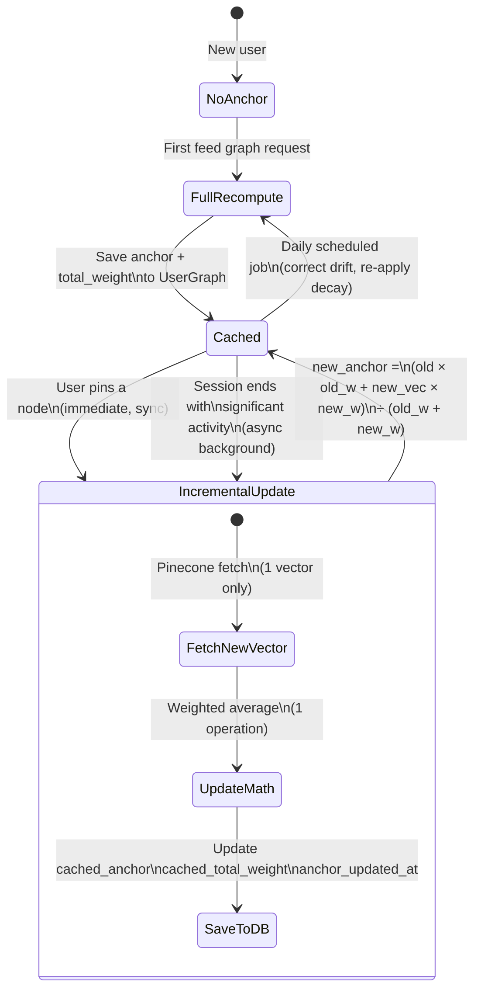
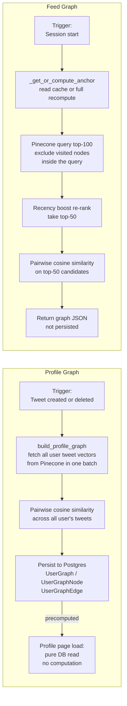
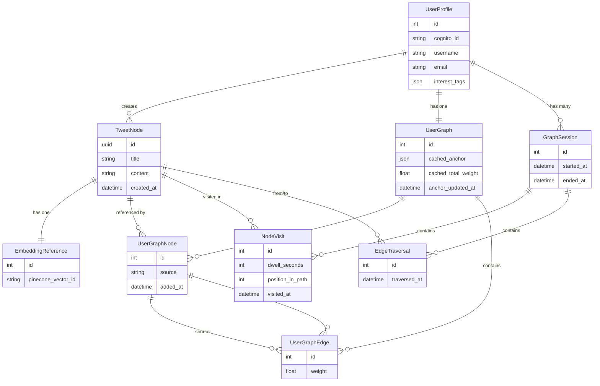

# SonderAI — Architecture Diagrams

---

## 1. System Architecture

Components grouped by layer and function.



---

## 2. System Workflow

End-to-end behavior across all major user journeys. Shows how every layer participates in each flow.

```mermaid
sequenceDiagram
    actor User
    participant FE as Next.js Frontend
    participant API as Django API
    participant Cognito as AWS Cognito
    participant PG as PostgreSQL
    participant PC as Pinecone
    participant OAI as OpenAI
    participant BG as Background Thread

    %% ─────────────────────────────────
    %% AUTHENTICATION
    %% ─────────────────────────────────
    rect rgb(230, 245, 255)
        note over User,OAI: Authentication
        User->>FE: Sign up / Sign in
        FE->>Cognito: Authenticate credentials
        Cognito-->>FE: JWT token
        FE->>API: POST /api/v1/users/onboarding/ (JWT + interest tags)
        API->>Cognito: Validate JWT
        Cognito-->>API: Claims (cognito_id)
        API->>PG: INSERT UserProfile (cognito_id, interest_tags)
        API-->>FE: 200 OK
    end

    %% ─────────────────────────────────
    %% TWEET CREATION
    %% ─────────────────────────────────
    rect rgb(230, 255, 235)
        note over User,OAI: Tweet Creation
        User->>FE: Write and submit tweet
        FE->>API: POST /api/v1/tweets/ (JWT + title + content)
        API->>Cognito: Validate JWT
        API->>PG: INSERT TweetNode (uuid, title, content)
        API->>OAI: embed(title + content) → 1536d vector
        OAI-->>API: vector
        API->>PC: upsert(tweet_id, vector, metadata)
        API->>PG: INSERT EmbeddingReference
        API->>BG: spawn → build_profile_graph(user)
        API-->>FE: 201 Created { id, title, content }

        BG->>PC: fetch(all user tweet vectors)
        BG->>BG: pairwise cosine similarity
        BG->>PG: upsert UserGraph / UserGraphNode / UserGraphEdge
    end

    %% ─────────────────────────────────
    %% FEED GRAPH LOAD
    %% ─────────────────────────────────
    rect rgb(255, 245, 220)
        note over User,OAI: Feed Graph Load (session start)
        User->>FE: Open app / home page
        FE->>API: GET /api/v1/graph/feed/ (JWT)
        API->>Cognito: Validate JWT
        API->>PG: Read UserGraph.cached_anchor

        alt No cached anchor (first session)
            API->>PC: fetch vectors for all pinned nodes + visits + traversals
            API->>API: _full_anchor_recompute\n(recency-decayed weighted centroid)
            API->>PG: Save cached_anchor + cached_total_weight
        else Cached anchor exists
            API->>API: Use cached_anchor directly
        end

        API->>PG: Get visited tweet IDs (NodeVisit)
        API->>PC: query top-100\n(anchor vector, exclude visited IDs)
        PC-->>API: 100 candidates with vectors + metadata
        API->>API: _recency_boost\n(re-rank by similarity × e^-λt, take top-50)
        API->>PG: Bulk fetch TweetNode objects
        API->>API: _compute_edges\n(pairwise cosine similarity, threshold=0.7)
        API-->>FE: { nodes: [...], edges: [...] }
        FE->>FE: Render graph (react-force-graph-2d/3d)
        FE->>API: POST /api/v1/interactions/session/ → start GraphSession
    end

    %% ─────────────────────────────────
    %% GRAPH NAVIGATION
    %% ─────────────────────────────────
    rect rgb(255, 230, 245)
        note over User,OAI: Graph Navigation (within session)
        User->>FE: Click a node
        FE->>API: POST /api/v1/interactions/visit/\n(tweet_id, position_in_path)
        API->>PG: INSERT NodeVisit (start dwell timer)

        User->>FE: Read tweet, follow an edge
        FE->>API: POST /api/v1/interactions/visit/ (dwell_seconds)
        API->>PG: UPDATE NodeVisit.dwell_seconds
        FE->>API: POST /api/v1/interactions/traverse/\n(from_tweet_id, to_tweet_id)
        API->>PG: INSERT EdgeTraversal

        User->>FE: Close app / end session
        FE->>API: POST /api/v1/interactions/session/end/
        API->>PG: UPDATE GraphSession.ended_at

        alt Significant activity this session\n(pin OR 3+ visits >10s OR 2+ traversals)
            API->>BG: spawn → incremental anchor update
            BG->>PC: fetch vectors for new signals only
            BG->>BG: new_anchor = (old × old_w + new_vec × new_w) / (old_w + new_w)
            BG->>PG: UPDATE cached_anchor, cached_total_weight
        end
    end

    %% ─────────────────────────────────
    %% NODE PIN
    %% ─────────────────────────────────
    rect rgb(240, 230, 255)
        note over User,OAI: Pin a Node ("Add to my graph")
        User->>FE: Pin a tweet
        FE->>API: POST /api/v1/graph/pin/ (tweet_id)
        API->>PG: INSERT UserGraphNode (source=pinned)
        API->>PC: fetch(tweet vector)
        API->>PG: fetch vectors for existing UserGraph nodes
        API->>API: compute similarity vs all existing nodes
        API->>PG: INSERT UserGraphEdge records (weight ≥ 0.7)
        API->>BG: spawn → _incremental_anchor_update (pin signal, immediate)
        BG->>PC: fetch(pinned tweet vector)
        BG->>BG: weighted average update
        BG->>PG: UPDATE cached_anchor, cached_total_weight
        API-->>FE: 200 OK
    end

    %% ─────────────────────────────────
    %% PROFILE GRAPH LOAD
    %% ─────────────────────────────────
    rect rgb(235, 255, 245)
        note over User,OAI: Profile Graph Load
        User->>FE: Visit a user's profile
        FE->>API: GET /api/v1/graph/profile/{user_id}/
        API->>PG: SELECT UserGraphNode + UserGraphEdge\n(pure DB read, no computation)
        PG-->>API: nodes + edges
        API-->>FE: { nodes: [...], edges: [...] }
        FE->>FE: Render profile graph
    end
```



---

## 3. Feed Graph Construction Flow

Detailed flowchart of the feed graph algorithm.

```mermaid
flowchart TD
    A([Session Start\nGET /api/v1/graph/feed/]) --> B{UserGraph.cached_anchor\nexists?}

    B -->|Yes| D[Use cached anchor]
    B -->|No| C[_full_anchor_recompute\nfetch all historical signals\nfrom Pinecone + DB]
    C --> C2[Save anchor + total_weight\nto UserGraph]
    C2 --> D

    D --> E[Get all visited tweet IDs\nfrom NodeVisit table]
    E --> F[Query Pinecone top-100\nwith visited IDs excluded\ninside the query]
    F --> G[_recency_boost\nre-rank by similarity × e^\(-λ × days\)\ntake top-50]
    G --> H[Bulk fetch TweetNode\nobjects from Postgres]
    H --> I[_compute_edges\npairwise cosine similarity\nO n² — at n=50, 1225 comparisons\nthreshold = 0.7]
    I --> J[Return graph JSON\n{ nodes, edges }]
    J --> K([Frontend renders graph\nreact-force-graph-2d/3d])
```

---

## 4. Anchor Lifecycle

How the anchor embedding is created, cached, and kept fresh.



---

## 5. Profile Graph vs Feed Graph

How the two graph types differ in construction, storage, and serving.



---

## 6. Data Model

Core models and their relationships.


